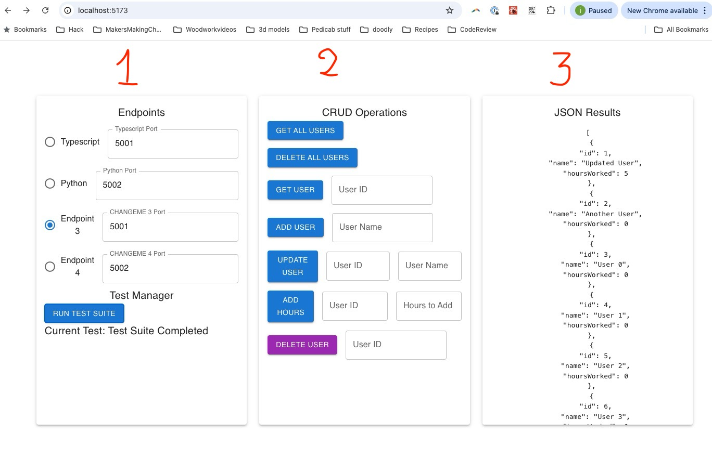

# REST-MULTI-LANGUAGE.md

## Assignment: Implement a RESTful API in Multiple Languages (in addition to typescript and python)

## Class exercise
we will implement the server in rust so you in class so you can experience the process.   This, unfortunately, means that you cannot choose rust as one of your languages for this assignment.

### Objective
Your assignment is to extend the existing project by implementing two additional servers that replicate the functionality of the TypeScript server and the Python server that implement the routes in `ROUTES.md`. This will allow you to explore RESTful API implementation in multiple programming languages and understand how each language approaches backend server development.

### Setup Instructions

#### Run the Client Tester
The client application will allow you to test the functionality of the server.
- To run the client tester,
- Clone the repository then cd into the directory
- use the command:
  ```bash
  npm install
  npm run dev
  ```
- The client is set up to communicate with the TypeScript server on **port 5001** and the Python server on **port 5002**.

- In the left panel you can set the port numbers for your two servers. 
  - You can see that the typescript and python servers are already set up, and you cannot change them.  
  - You will need to add two more servers to the tester and set the port numbers for those servers.  
  - You will also need to update the code in the tester to indicate what languages you chose.  
    - Search for `CHANGEME` in the code to find where to make the changes.
- In the middle panel you can test inidividual routes to your server
- In the right panel you can see the response text (if it is an error) or the response data (if it is a success).


#### Run the TypeScript Server
The TypeScript server is located under `src/servers/ts-server/`.
- To start the server, run the following command:
  ```bash
  ts-node src/servers/ts-server/server.ts
  ```
- Make sure that the server is running on **port 5001**.

#### Run the Python server
The Python server is located under `src/servers/python-server/`

Instructions for setting up and running the Python server can be found in the `README.md` file in the `src/servers/python-server` directory
- Ensure that the client is communicating with the Python server by setting the **port to 5002**. (it is set up this way)

#### Routes for the server.
- All routes for the server are documented in the file ROUTES.md


#### Test CRUD Operations
- Use the fields in the client application to enter parameters for different CRUD operations.
- You can test the following endpoints:
  - **GET all users**
  - **GET user by ID**
  - **POST new user**
  - **PUT (update) user by ID**
  - **PATCH (add hours) for user by ID**
  - **DELETE user by ID**
  - **DELETE all users**

### Test Suite
The test suite implements the following sequence of operations to verify the server's functionality:

1. **Delete All Users**: Ensure that the users list is empty.
2. **Get All Users**: Verify the empty response.
3. **Add a User**: Add a user named "Test User".
4. **Get User by ID**: Retrieve the user and verify the information.
5. **Add Another User**: Add a second user named "Another User".
6. **Update User by ID**: Update the first user's name to "Updated User".
7. **Add Hours Worked**: Add 5 hours to the first user.
8. **Add Multiple Users**: Add 9 more users.
9. **Get All Users**: Ensure all users are present.
10. **Delete a User by ID**: Delete the last added user and verify the result.

### Note
You are allowed to use ChatGPT or any other generative AI tools to help generate code for this assignment. Make sure you understand the code and can explain how it works.  In fact, the purpose of this assigment is for you to develop skills in using generativeAI tools to build software.  You are encouraged to use these tools to help you complete the assignment.

### Assignment Requirements
Your task is to implement at least two additional servers that provide the same RESTful functionality. Each server should be placed under `src/servers/<language-server>/`. You may choose any programming languages you are comfortable with (e.g., Java, C#, Ruby, Go, etc.).  *Note:* you cannot choose Javascript as one of the other languages.

For each server:
- **Directory Structure**: Place each server in a separate directory under `src/servers/`. For example, `src/servers/erlang-server/` or `src/servers/java-server/`.
- **Functionality**: Ensure that each server has the same endpoints and functionality as the TypeScript server.
- **Port Configuration**: Set each new server to run on a different port locally (e.g., 5003, 5004) to avoid conflicts.
- **README.md**: Include a `README.md` file in each server directory explaining how to set up and run the server. This README should provide:
  - A step by step guide to set up the server.  
    - If possible test on mac and windows.
    - Specify which platforms you have tested on.
  - Installation requirements.
  - Commands to start the server.
  - Any additional setup instructions.

- **Tester Update**: Update the code in MainControl.tsx to indicate what languages you chose.  Search for `CHANGEME` in the code to find where to make the changes 

### Grading Criteria
- **Functionality**: Each of the two servers (The two additional servers) must pass the test suite outlined above.
- **Consistency**: Ensure that the endpoints and responses are consistent with the TypeScript and the Python servers
- **Code Quality**: Ensure your code is clean, well-commented, and follows best practices for the chosen language.
- **Documentation**: Provide clear instructions in the `README.md` for each server.
- **Documentation**: Edit the `LESSONS_LEARNED.md` file that captures insights and observations from working with multiple languages.  This is optional, but you might find it useful in the future when you look back on this project.

### Grade Calculation
- You get 5 points for each server you implement up to a maximum of 10. 
- If your README.md contains errors and the TA or professor cannot run the server then the server is not complete.
  - it is really important to make sure that this `README.md` is correct and that the server can be run by the TA or professor.
  - If the server cannot be run, then the server is not complete.
- A server is considered complete if the tester runs the suite against your server and it passes all tests.
  - Apart from making the changes in the tester where you find `CHANGEME` you should not need to make any changes to the tester.
- Additional servers will make you happy and joyful.

### Team Testing
Before submission, have a team member clone your repository and follow the setup instructions literally to ensure everything works as expected. This will help catch any issues or missing details in your documentation.

### Submission Instructions
- Fork the repository and make a public github repository for your team.
- Submit your project repository containing the following:
  - **src/servers/ts-server/** (TypeScript server already there)
  - **src/servers/python-server/** (Python server already there)
  - **src/servers/<language1-server>/** (First additional server)
  - **src/servers/<language2-server>/** (Second additional server)
- Ensure all servers are functional and can be tested using the client application.

### How to approach this assignment.
- Start by reading both the TypeScript and the Python server code to understand how the server works.
- Choose a language you are comfortable with and start implementing the server.
- Use the existing servers code to interact with your generativeAI tool to help you generate the code for the new servers.
- Test your server using the client application to ensure it works as expected.
- Understand how this server is implemented in your two languages of choice.
- Explain the code to your other team members so they can understand how it works.
- If you get stuck, reach out to your team members or the instructor for help.
- If you get two languages done really quickly, consider adding a third language to the project.

Good luck, and feel free to reach out if you have any questions!
